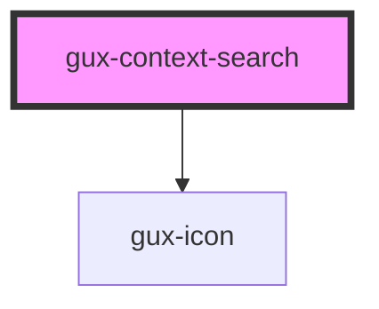

# gux-context-search

<!-- Auto Generated Below -->

## Properties

| Property            | Attribute            | Description                                                             | Type      | Default     |
| ------------------- | -------------------- | ----------------------------------------------------------------------- | --------- | ----------- |
| `currentMatch`      | `current-match`      | The Current match count which needs to highlighted                      | `number`  | `0`         |
| `disableNavigation` | `disable-navigation` | Disables the Next and Previous buttons.                                 | `boolean` | `false`     |
| `disabled`          | `disabled`           | Disable the input and prevent interactions.                             | `boolean` | `false`     |
| `eraseLabel`        | `erase-label`        | The label for the erase button                                          | `string`  | `''`        |
| `matchCount`        | `match-count`        | The Match Count                                                         | `number`  | `0`         |
| `navigationLabel`   | `navigation-label`   | The label for the navigate panel                                        | `string`  | `''`        |
| `nextLabel`         | `next-label`         | The label for the navigate next button                                  | `string`  | `''`        |
| `placeholder`       | `placeholder`        | The input placeholder.                                                  | `string`  | `''`        |
| `previousLabel`     | `previous-label`     | The label for the navigate previous button                              | `string`  | `''`        |
| `srLabel`           | `sr-label`           | Aria label to use in case the text field does not have an actual label. | `string`  | `undefined` |
| `value`             | `value`              | Indicate the input value                                                | `string`  | `''`        |

## Events

| Event      | Description                                 | Type               |
| ---------- | ------------------------------------------- | ------------------ |
| `input`    | Triggered when user inputs.                 | `CustomEvent<any>` |
| `navigate` | Triggered when user click navigate buttons. | `CustomEvent<any>` |

## Methods

### `clear() => Promise<void>`

Clears the input.

#### Returns

Type: `Promise<void>`

### `setInputFocus() => Promise<void>`

Sets the input focus to the text input.

#### Returns

Type: `Promise<void>`

## Dependencies

### Depends on

- [gux-icon](../../stable/gux-icon)

### Graph

----------------------------------------------

*Built with [StencilJS](https://stenciljs.com/)*
